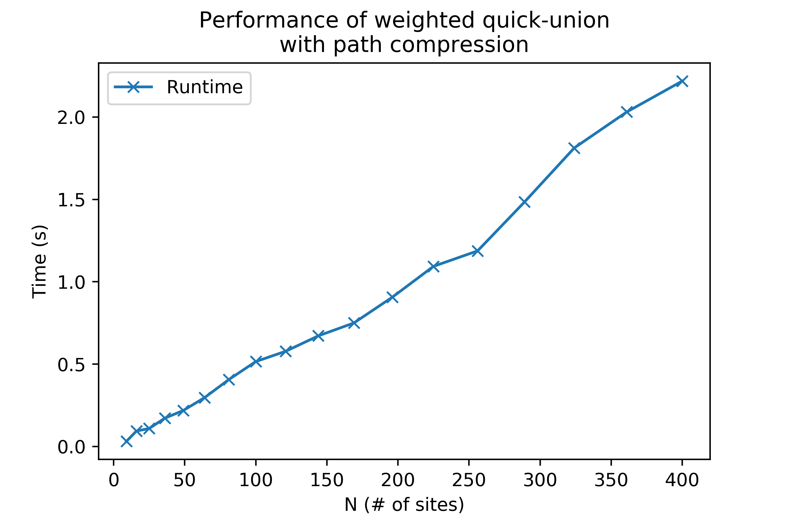

# Percolation

This folder stores a python-based approach to the first assignment in [Algorithms, Part I](https://www.coursera.org/learn/algorithms-part1) on Coursera, [Percolation](https://coursera.cs.princeton.edu/algs4/assignments/percolation/specification.php).

## Code
`quickfind.py` holds the class `WeightedQuickUF(n)`, which implements height-based weighted quick union-find, with path compression, for n elements.
- `WeightedQuickUF.find(p)` finds the root element of p, while compressing the path
- `WeightedQuickUF.union(p, q)` merges the set containing p with the set containing q, with the shorter (by height) path being connected to the root of the longer (by height) path

`percolation.py` holds the class `Percolation(N)`, which initiates an NxN grid and determines whether the grid would percolate (a pixel on the bottom row is connected to a pixel on the top row, allowing a liquid to flow from top to bottom of the mock-porous surface).
- `Percolation.Open(row, col)` opens the pixel at (row, col), and connects it to its open neighbors (above, below, right, and left)
- `Percolation.isFull(row, col)`  returns whether the pixel at (row, col) is connected to the top row, and thereby "full" of liquid
- `Percolation.percolates()` returns whether the entire grid percolates

`stats.py` holds the class `PercolationStats(n, trials)` which approximates what fraction of full pixels are needed in order for an nxn grid to percolate
- `Percolation.Stats()` runs repeated trials by randomly filling (row, col) pairs until the system percolates, then logs the mean, standard deviation, and top/bottom of the 95% confidence for the % of full pixels when the system percolates

## Results
Using `PercolationStats(n, trials)` repeatedly, we can see that the % of full pixels required for a system to percolate converges to ~59%, as n increases, while the estimate becomes more accurate (as measured by a decreasing 95% confidence range) as trials increases.

## Performance
We can find the performance of the `WeightedQuickUF(n)` algorithm implementation from repeatedly calling `Percolation` for different grid sizes. Below is graphed the runtime for 100 trials, for different # of elements n.

Sure enough, runtime increases approximately linearly with # of elements.

## Demos
Demonstrations of each algorithm, and the eventual performance calculation, can be found in `demo.ipynb`.
